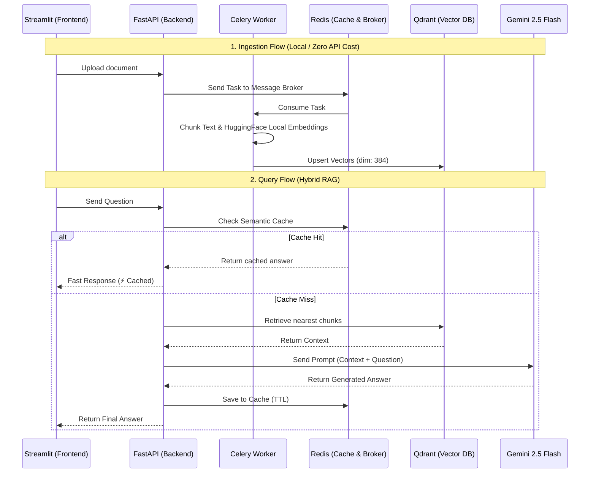

# DocuQuery Enterprise RAG

DocuQuery Enterprise RAG is a document question-answering system built around FastAPI, Celery, Redis, Qdrant, and Streamlit.

The current architecture uses hybrid retrieval:
- Local embeddings with `sentence-transformers` through `langchain-huggingface`
- Gemini chat generation through `langchain-google-genai`
- Redis semantic cache for repeated questions
- Qdrant as the persistent vector database
- Celery for asynchronous document ingestion (`.pdf`, `.docx`, `.txt`)

## Architecture

### System Architecture Diagram



### Ingestion flow
1. A client uploads a document (`.pdf`, `.docx`, or `.txt`) to `POST /api/v1/documents/upload`.
2. FastAPI stores the file in `uploads/` and sends a Celery task.
3. The Celery worker selects the proper loader based on file extension, extracts text, chunks it, creates local embeddings, and upserts vectors into Qdrant.
4. For PDF files, page metadata is preserved so citations can show the source page later.

### Query flow
1. A client sends a question to `POST /api/v1/query`.
2. The backend checks Redis for a cached answer.
3. On cache miss, it embeds the query locally, retrieves the nearest chunks from Qdrant, formats a prompt, and sends the prompt to Gemini.
4. The final answer and structured citation context are cached in Redis and returned to the client.

## Tech Stack

- Backend API: FastAPI, Uvicorn
- Async worker: Celery
- Broker and cache: Redis
- Vector database: Qdrant
- Retrieval and prompting: LangChain
- Local embeddings: `all-MiniLM-L6-v2`
- LLM: Gemini via `langchain-google-genai`
- Frontend: Streamlit
- Testing: Pytest, FastAPI `TestClient`, `httpx`

## Project Structure

```text
DocuQuery-Enterprise-RAG/
├── frontend/
│   └── app.py
├── src/
│   ├── main.py
│   ├── rag_engine.py
│   ├── schemas.py
│   └── worker.py
├── tests/
│   └── test_api.py
├── uploads/
├── .env.example
├── docker-compose.yml
├── docs.md
├── README.md
└── requirements.txt
```

## Requirements

- Python 3.10+
- Docker Desktop or Docker Engine
- A valid `GOOGLE_API_KEY`

## Environment Setup

Create a `.env` file in the project root:

```env
GOOGLE_API_KEY=your_gemini_key_here
```

Optional variables:

```env
QDRANT_HOST=localhost
QDRANT_PORT=6333
QDRANT_COLLECTION=docuquery_hybrid_v1
REDIS_HOST=localhost
REDIS_PORT=6379
REDIS_DB=0
UPLOAD_DIR=uploads
RAG_TOP_K=5
CHUNK_SIZE=1000
CHUNK_OVERLAP=150
LOCAL_EMBEDDING_MODEL=all-MiniLM-L6-v2
GEMINI_CHAT_MODEL=models/gemini-2.5-flash
```

## Installation

Install Python dependencies:

```bash
pip install -r requirements.txt
```

Start infrastructure services:

```bash
docker compose up -d
```

## Run the Backend

Start the FastAPI server:

```bash
uvicorn src.main:app --host 0.0.0.0 --port 8000 --reload
```

Start the Celery worker in another terminal:

```bash
celery -A src.worker.celery_app worker --loglevel=info --pool=solo
```

`--pool=solo` is the safest default on Windows.

## Run the Frontend

Start Streamlit:

```bash
streamlit run frontend/app.py
```

Frontend URL:

```text
http://localhost:8501
```

Backend URL:

```text
http://localhost:8000
```

## API Endpoints

### Upload document

```http
POST /api/v1/documents/upload
Content-Type: multipart/form-data
```

Supported file types:
- `.pdf`
- `.docx`
- `.txt`

Response:

```json
{
  "task_id": "uuid"
}
```

### Check ingestion status

```http
GET /api/v1/documents/status/{task_id}
```

Response:

```json
{
  "task_id": "uuid",
  "status": "SUCCESS",
  "result": {
    "status": "ingested",
    "source": "path-to-file",
    "chunks_indexed": 42
  },
  "error": null
}
```

### List uploaded documents

```http
GET /api/v1/documents
```

Response:

```json
{
  "documents": [
    "0d2b4c8a-1c95-4d4d-a13f-123456789abc_sample.pdf",
    "4f949d45-7840-4178-b13e-abcdef123456_notes.docx"
  ]
}
```

### Query documents

```http
POST /api/v1/query
Content-Type: application/json
```

Request:

```json
{
  "query": "Summarize this document"
}
```

Response:

```json
{
  "query": "Summarize this document",
  "answer": "...",
  "cached": false,
  "context": [
    {
      "source_file": "0d2b4c8a-1c95-4d4d-a13f-123456789abc_sample.pdf",
      "source_path": "E:/Project/DocuQuery-Enterprise-RAG/uploads/0d2b4c8a-1c95-4d4d-a13f-123456789abc_sample.pdf",
      "chunk_index": 6,
      "page_number": 12,
      "text": "Relevant excerpt from the document..."
    }
  ]
}
```

### Reset workspace

```http
DELETE /api/v1/workspace/reset
```

This endpoint:
- deletes the active Qdrant collection
- recreates an empty collection
- clears only DocuQuery cache keys from Redis
- removes uploaded files from `uploads/`

Response:

```json
{
  "status": "workspace_reset",
  "collection": "docuquery_hybrid_v1",
  "cache_cleared": true,
  "cache_keys_deleted": 3,
  "vector_store_cleared": true,
  "deleted_files": 2
}
```

## Frontend Features

- Automatic upload from the sidebar for `.pdf`, `.docx`, and `.txt`
- Task polling with progress UI while Celery is still processing
- Chat-style interface with `st.chat_message`
- Simulated streaming output with `st.write_stream()`
- Persistent session chat history
- Visual `⚡ Cached` marker for Redis cache hits
- Source citation view grouped by file, with chunk number and PDF page number when available
- Workspace reset button that also clears chat history and uploaded files
- Backend connection error handling for upload, polling, query, and reset flows

## Testing

Run the API test suite:

```bash
pytest tests/ -v
```

Current automated coverage includes:
- Black-box upload validation for valid, empty, and invalid file inputs
- White-box branch coverage for query cache hit and cache miss paths

## Notes

- Upload and indexing do not consume Gemini quota because embeddings are local.
- Detailed questions can take longer because Gemini is only used during answer generation.
- Qdrant uses a separate collection name, `docuquery_hybrid_v1`, to avoid vector dimension conflicts with older embedding strategies.
- Redis cache stores both the generated answer and structured citation context.
- File names are stored with a UUID prefix on disk to avoid collisions; the frontend strips that prefix for display.

## Troubleshooting

### `FAILURE` in task status after upload

Check:
- Redis is running on port `6379`
- Qdrant is running on port `6333`
- The Celery worker is running

### `404 NOT_FOUND` from Gemini

Set `GEMINI_CHAT_MODEL` in `.env` to a model available in your Gemini project, for example:

```env
GEMINI_CHAT_MODEL=models/gemini-2.5-flash
```

### Upload seems stuck in Streamlit

The frontend polls Celery status for up to `300` seconds. If processing exceeds that window:
- confirm the Celery worker is running
- inspect worker logs for loader or embedding errors
- retry after the worker finishes, or upload a smaller document

### Streamlit times out on long answers

The frontend already waits up to `120` seconds. If needed, increase the timeout in [frontend/app.py](./frontend/app.py).

## License

This project is licensed under the terms of the [LICENSE](./LICENSE) file.
