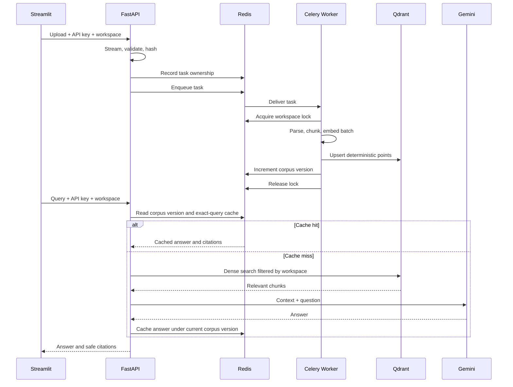

# DocuQuery — Workspace-Scoped RAG

DocuQuery is a CV-oriented document question-answering prototype built with FastAPI, Celery, Redis, Qdrant, local sentence-transformer embeddings, Gemini, and Streamlit.

It demonstrates asynchronous ingestion, dense vector retrieval, page-aware citations, exact-query response caching, workspace isolation, and defensive upload handling. It is not presented as a production multi-tenant platform; the security boundary and remaining limitations are documented below.

## What it demonstrates

- Asynchronous PDF, DOCX, and UTF-8 TXT ingestion through Celery.
- Local `all-MiniLM-L6-v2` embeddings, so indexing does not consume Gemini quota.
- Dense similarity search in Qdrant with workspace filters.
- Gemini answer generation using retrieved document context.
- Exact-query Redis caching keyed by workspace and corpus version.
- Automatic cache invalidation after successful ingestion or reset.
- Deterministic vector IDs derived from workspace, document content, and chunk index.
- Source citations with safe filename, document ID, chunk index, and PDF page number.
- Upload size, signature, structure, UTF-8, and DOCX expansion checks.
- API-key protection and logical workspace isolation.

## Architecture


```mermaid
sequenceDiagram
    participant UI as Streamlit
    participant API as FastAPI
    participant R as Redis
    participant W as Celery Worker
    participant Q as Qdrant
    participant L as Gemini

    UI->>API: Upload + API key + workspace
    API->>API: Stream, validate, hash
    API->>R: Record task ownership
    API->>R: Enqueue task
    R->>W: Deliver task
    W->>R: Acquire workspace lock
    W->>W: Parse, chunk, embed batch
    W->>Q: Upsert deterministic points
    W->>R: Increment corpus version
    W->>R: Release lock

    UI->>API: Query + API key + workspace
    API->>R: Read corpus version and exact-query cache
    alt Cache hit
        R-->>API: Cached answer and citations
    else Cache miss
        API->>Q: Dense search filtered by workspace
        Q-->>API: Relevant chunks
        API->>L: Context + question
        L-->>API: Answer
        API->>R: Cache answer under current corpus version
    end
    API-->>UI: Answer and safe citations
```

### Cache correctness

Answers use this logical Redis key:

```text
rag:answer:<workspace_id>:<corpus_version>:<sha256(normalized_query)>
```

Successful ingestion and reset increment `rag:corpus_version:<workspace_id>`. Old answers expire through TTL but become unreachable immediately, preventing a repeated question from returning an answer for an earlier document set.

## Security boundary

Every `/api/v1` request requires:

```http
X-API-Key: <DOCUQUERY_API_KEY>
X-Workspace-ID: <workspace-id>
```

The API key is compared in constant time and the service fails closed when no server key is configured. Workspace IDs are validated slugs and scope files, vectors, cache entries, tasks, queries, and reset operations.

This is logical isolation for a controlled demo. All clients share one API key, so a holder of that key can choose another valid workspace ID. JWT/OAuth, users, roles, organization membership, malware scanning, rate limiting, and cryptographic tenant isolation are outside the current scope.

## Project structure

```text
DocuQuery-Enterprise-RAG/
├── frontend/app.py
├── scripts/benchmark_docuquery.py
├── src/
│   ├── main.py
│   ├── rag_engine.py
│   ├── schemas.py
│   ├── security.py
│   ├── uploads.py
│   └── worker.py
├── tests/
├── .env.example
├── docker-compose.yml
└── requirements.txt
```

## Requirements

- Python 3.10+
- Docker Desktop or Docker Engine
- A Gemini API key

## Setup

Create and activate a virtual environment, then install dependencies:

```bash
python -m venv .venv
pip install -r requirements.txt
```

Copy `.env.example` to `.env` and set at least:

```env
GOOGLE_API_KEY=your_gemini_key_here
DOCUQUERY_API_KEY=replace_with_a_long_random_value
DOCUQUERY_WORKSPACE_ID=default
```

Generate a long random API key rather than using the example value.

Start Redis and Qdrant:

```bash
docker compose up -d
```

Start the API:

```bash
uvicorn src.main:app --host 0.0.0.0 --port 8000 --reload
```

Start the worker in another terminal:

```bash
celery -A src.worker.celery_app worker --loglevel=info --pool=solo
```

`--pool=solo` is the safest Windows development default.

Start the frontend:

```bash
streamlit run frontend/app.py
```

The frontend reads `DOCUQUERY_API_BASE_URL`, `DOCUQUERY_API_KEY`, and `DOCUQUERY_WORKSPACE_ID` from the environment.

## API

The examples assume:

```bash
API_KEY=replace_with_a_long_random_value
WORKSPACE=default
```

### Upload

```bash
curl -X POST http://localhost:8000/api/v1/documents/upload \
  -H "X-API-Key: $API_KEY" \
  -H "X-Workspace-ID: $WORKSPACE" \
  -F "file=@report.pdf"
```

```json
{
  "task_id": "e7b6d87c-f384-478d-b314-14e1db174718",
  "document_id": "2cf24dba5fb0a30e26e83b2ac5b9e29e1b161e5c1fa7425e73043362938b9824"
}
```

Default limits are 25 MiB uploaded and 100 MiB declared uncompressed DOCX content. PDFs require a PDF signature, DOCX files require the expected ZIP members, and text files must contain non-whitespace UTF-8 text.

### Task status

```bash
curl http://localhost:8000/api/v1/documents/status/<task-id> \
  -H "X-API-Key: $API_KEY" \
  -H "X-Workspace-ID: $WORKSPACE"
```

A task ID is visible only from the workspace that created it. Worker failures return a generic message without internal paths or exception details.

### List documents

```bash
curl http://localhost:8000/api/v1/documents \
  -H "X-API-Key: $API_KEY" \
  -H "X-Workspace-ID: $WORKSPACE"
```

### Query

```bash
curl -X POST http://localhost:8000/api/v1/query \
  -H "Content-Type: application/json" \
  -H "X-API-Key: $API_KEY" \
  -H "X-Workspace-ID: $WORKSPACE" \
  -d '{"query":"Summarize the document"}'
```

```json
{
  "query": "Summarize the document",
  "answer": "...",
  "cached": false,
  "context": [
    {
      "source_file": "report.pdf",
      "document_id": "2cf24dba5fb0a30e26e83b2ac5b9e29e1b161e5c1fa7425e73043362938b9824",
      "chunk_index": 0,
      "page_number": 1,
      "text": "Relevant excerpt..."
    }
  ]
}
```

No absolute server path is returned.

### Reset one workspace

```bash
curl -X DELETE http://localhost:8000/api/v1/workspace/reset \
  -H "X-API-Key: $API_KEY" \
  -H "X-Workspace-ID: $WORKSPACE"
```

Reset shares a Redis lock with ingestion and deletes only that workspace's uploaded files and Qdrant points.

## Testing

Unit/API tests mock external service boundaries and do not require live Redis, Qdrant, Gemini, or Hugging Face downloads:

```bash
pytest tests -q
```

The suite covers authentication, workspace validation, upload safety and cleanup, task ownership, cache versioning, lazy model construction, deterministic vector IDs, filtered retrieval, worker cleanup, reset isolation, and safe error responses.

## Benchmark

With the API and worker running:

```bash
python scripts/benchmark_docuquery.py \
  --file path/to/document.pdf \
  --query "Summarize the document" \
  --api-key "$API_KEY" \
  --workspace-id "$WORKSPACE" \
  --reset
```

The script measures ingestion latency, first-query latency, repeated exact-query cache latency, and speedup. It is a local latency benchmark, not a retrieval-quality or concurrent-load evaluation.

## Upgrade note

Vectors created before workspace metadata was introduced are intentionally invisible to filtered retrieval. After upgrading, restart the API and worker, then re-ingest documents into the desired workspace. Existing root-level upload files can be removed manually after confirming they are no longer needed.

## Current limitations

- Shared static API key instead of user/role authorization.
- Dense retrieval without sparse search or reranking.
- Text-only PDF extraction; scanned documents need OCR before upload.
- No document metadata database or per-document deletion endpoint.
- Redis and Qdrant are the only services in Compose; API, worker, and frontend run locally.
- No declared persistent Docker volume, production monitoring, distributed tracing, or load-test guarantee.

## License

Licensed under the terms of [LICENSE](./LICENSE).
